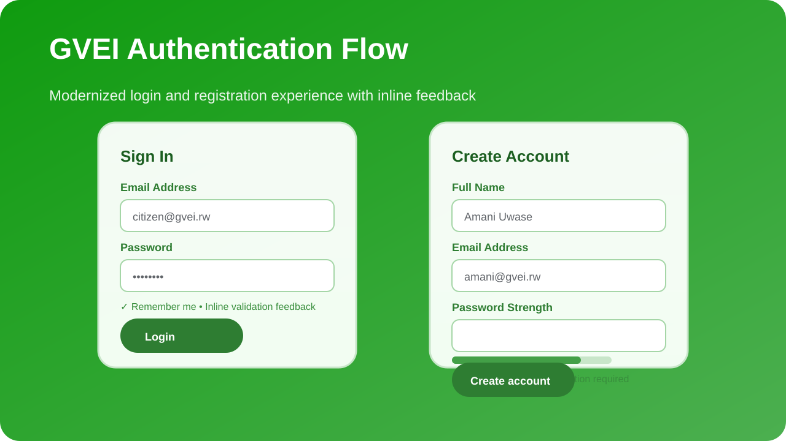

# 🌱 Green Vehicle Exchange Initiative (GVEI) Desktop Application

---

## 📸 Authentication Preview

> The refreshed login and registration screens feature a gradient-backed layout, inline validation, password-strength guidance, and remember-me support for a smoother onboarding experience.

---

## 🚀 Overview

The **GVEI Desktop Application** is a Java-based system to support Rwanda’s **Green Vehicle Exchange Initiative**, allowing citizens to exchange old fuel-powered vehicles for electric vehicles with government support.

It includes **citizen** and **admin** dashboards to manage vehicles, exchange offers, and generate reports.

---

## ✨ Features

### User Management
- Citizen registration and login.
- Admin login for system management.
- Role-based access control (citizen/admin).
- Modernized authentication experience with remember-me support and password-strength guidance.

### Vehicle Management
- Citizens can register vehicles:
  - Plate number, type, fuel type, manufacture year, mileage.
- List and view owned vehicles.
- Export vehicle data to **CSV**.

### Exchange Management
- Eligibility check based on:
  - Age > 5 years
  - Fuel type = Petrol/Diesel
- Citizens can apply for exchange offers.
- Admins can approve/reject offers.
- Offers display exchange value, subsidy percentage, and status.
- Export offer data to CSV.

### Reporting & Analytics
- Admin dashboard shows:
  - Approved exchanges.
  - Total subsidies paid.
  - Estimated carbon reduction (tons/year).
- Simple charts using **AWT Canvas**.

### UI

- Built with **Java Swing & AWT**.
- Logout button on top-right returns to login without closing the app.

$##PROJECT STRUCTURE
gvei/
├─ src/
│ ├─ AdminDashboard.java
│ ├─ CitizenDashboard.java
│ ├─ LoginFrame.java
│ ├─ RegisterFrame.java
│ ├─ VehicleRegistrationFrame.java
│ ├─ OfferApplicationFrame.java
│ ├─ DBConfig.java
│ ├─ UserDAO.java
│ ├─ VehicleDAO.java
│ ├─ OfferDAO.java
│ ├─ Utils.java
│ └─ ChartCanvas.java
├─ lib/
│ └─ mysql-connector-java-9.x.x.jar
├─ gvei.sql # Database schema and sample data
└─ README.md

---

## 🗄️ Database

### Database Name
`gvei`

### Tables

| Table             | Columns                                                                 |
|------------------|-------------------------------------------------------------------------|
| **users**        | user_id, name, email, password, role                                     |
| **vehicles**     | vehicle_id, owner_id, plate_no, vehicle_type, fuel_type, year, mileage   |
| **exchange_offers** | offer_id, vehicle_id, exchange_value, subsidy_percent, status           |

### Sample Users
- Citizens: `role = citizen`  
- Admin: `role = admin`  

---

## ⚙️ Setup Instructions

1. Install **MySQL/MariaDB** and create the `gvei` database.  
2. Import the provided `gvei.sql` for tables and sample data.  
3. Include **MySQL JDBC driver** in your project classpath (`lib/mysql-connector-java-9.x.x.jar`).  
4. Update `DBConfig.java` with your database credentials.  
5. Compile and run `LoginFrame.java`.

---

## 🖥️ Usage

1. Start with the **Login** screen.  
2. **Citizens**:
   - Register vehicles, view owned vehicles.
   - Apply for exchange offers.
   - Export vehicle lists.
3. **Admins**:
   - Manage and approve/reject offers.
   - View statistics and export reports.
4. Click **Logout** to return to login without closing the application.

---

## 💻 Requirements

- Java 17+  
- MySQL or MariaDB  
- JDBC Driver (MySQL Connector/J)  

---

## ⚠️ Notes

- Application uses **Swing** for UI and **AWT Canvas** for simple charts.  
- CSV exports allow external reporting and analysis.  
- Ensure JDBC driver version matches your Java version.

---
---

## 🗂️ Project Structure

